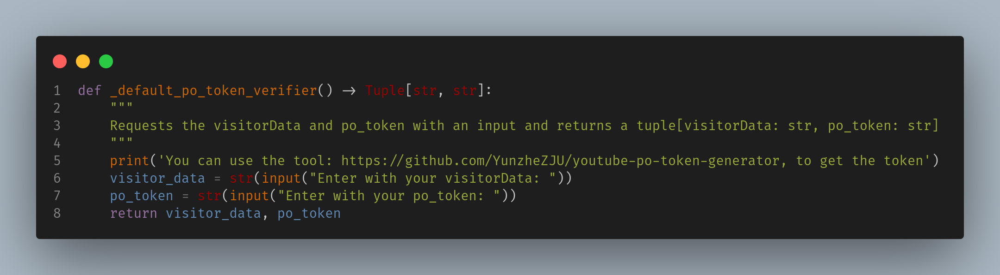

# Dowload YT python
Welcome to my project of download videos in python for initalitation this project is nesesary crear a virtaul enviroment:

## Installation
Clone the ropository with git:

```bash
git clone https://gitlab.com/personal8945746/python/download-list-music.git

```
### Virtual Enviroment
For create a virtual enviroment is nesesary this command and install dependece with pip:

```bash
# Linux
python3 -m venv ./download-list-music
cd download-list-music
source bin/activate
pip install -r requeriments.txt


# Windows
python -m venv download-list-music
cd download-list-music
Scripts\activate
pip install -r requirements.txt
```

## Pytubefix config

What you need is to search for this portion of code:


And change too:


The file name is : **innertube**
The dir name is : **lib64/python3.x.x/site-packages**


